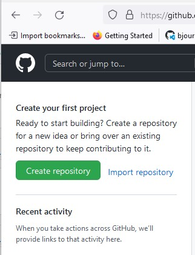
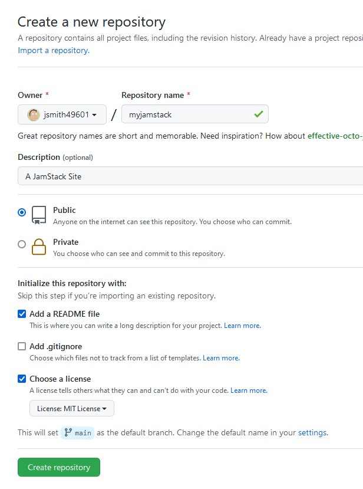
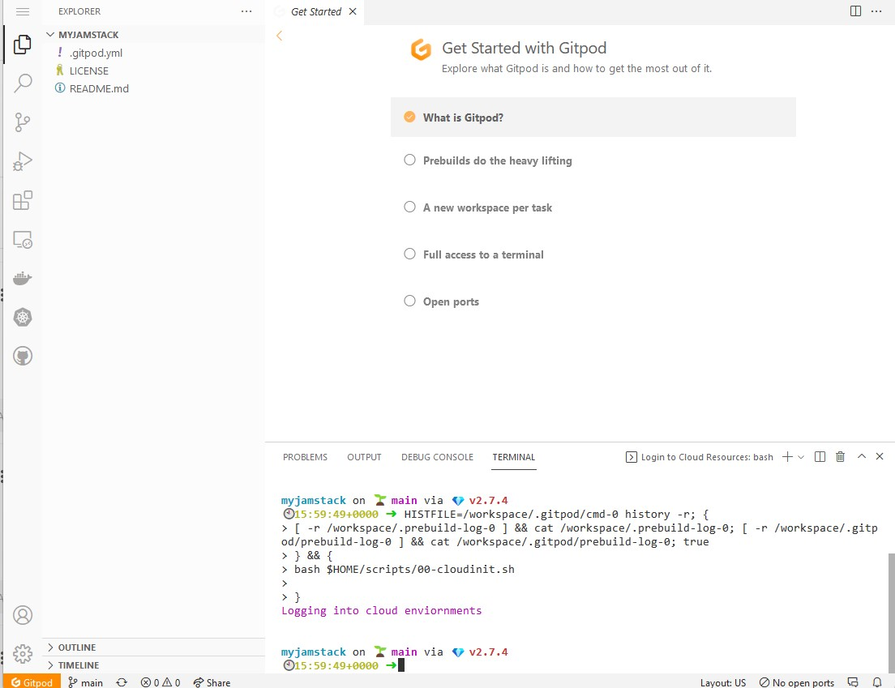
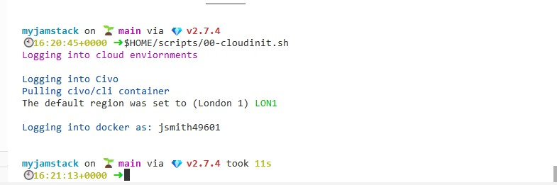

# Civo Development Environment with Gitpod

## Overview

Developing on Civo is a great experience!  A full Kubernetes-certified platform that is easy to deploy, consistent pricing, and 
an [amazing community](https://civo-community.slack.com/archives/CMVCKMCN5) - it's an amazing platform to get started.  Often 
the question is asked "how do I get started?" There are a lot of new concepts at work.  This overview will address how to 
quickly get started with a fully configured development envionment leveraging [GitPod](https://gitpod.io).  Gitpod is an
online development environment will be fully configured and a full variety of tools will be available for developing across 
a wide range of languages.

## Pre-requisites

To get started, you'll need to setup a few accounts ahead of time:

- [Github](https://github.com/) - A repository for your source code
- [Docker](https://hub.docker.com/signup) - A container registery to upload container images, so they can be deployed easily.
- [Civo](https://www.civo.com/signup) - The cloud provider to deploy your application.
- [Gitpod](https://www.gitpod.io/) - An online development environment.  Use your Github credentials for the smoothest experience.

## First - the repository

Let's start with an empty Github repository.  Click the "New Repository" link in Github, and give your repository a name.
We'll choose the name of `myjamstack` in this example.  We will choose to populate a README.md and give this repo an MIT
license.  




## Initial GitPod Configuration

Let's configure are repository to use a [custom Gitpod environment](https://github.com/ssmiller25/gitpod-k8s), which
will help configure the initial environment.  WIthin your new repo in Gitup, click the `Add File -> Create New File` button, 
the new file `.gitpod.yml`, and add the following contents

```yaml
image: quay.io/ssmiller25/gitpod-k8s:latest
tasks:
  - name: Login to Cloud Resources
    command: |
      bash $HOME/scripts/00-cloudinit.sh
vscode:
  extensions:
    - ms-azuretools.vscode-docker
    - ms-kubernetes-tools.vscode-kubernetes-tools
```

Commit the file to the main branch.  

## Start a GitPod Project

Now go to Gitpod, and create a new project.  Point to the new repository you created, and create the project in your personal space.
Once it's up, the environment should come up as below:



Look for the purple "Logging into cloud environment" text in the terminal.  To configure the environment, you'll need to obtain your Civo API key 
from [your security profile](https://www.civo.com/account/security).  With that and your docker credentials, run the following within the GitPod 
commandline:

```sh
gp env CIVO_API_KEY=xxxx-yyy-ccc
gp env DOCKER_USERNAME=dockerusername
gp env DOCKER_PASSWORD=$(echo -n 'yourdockerpassword' | base64)
# Load new env variables in new environment
eval $(gp env -e)
$HOME/scripts/00-cloudinit.sh
```

You should see messages similar to the following if the authentication worked



## Environment is Now Complete

You now have a complete enviornment, ready to begin development.  GitPod's base environment has tooling to help develop
in Go, Java, Node.js, C/C++, Python, Ruby, Rust, and PHP along with Docker and a few other utitlies.  The custom
image adds Kubernetes CLI tools, VScode plugs, and eases environment login to Civo and Docker so that you can being
developing immediately.  From this base, we can now begin developing and deploying apps.

## Additional Information

- [Gitpod-K8S](https://github.com/ssmiller25/gitpod-k8s)
- [Civo Online Meetup #14 - Youtube](https://www.youtube.com/watch?v=wQ9LtQ7uaeY&t=1416s)
- [Philippe Charrière GitPod Repo](https://gitlab.com/k33g_org/bob)