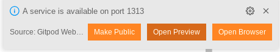
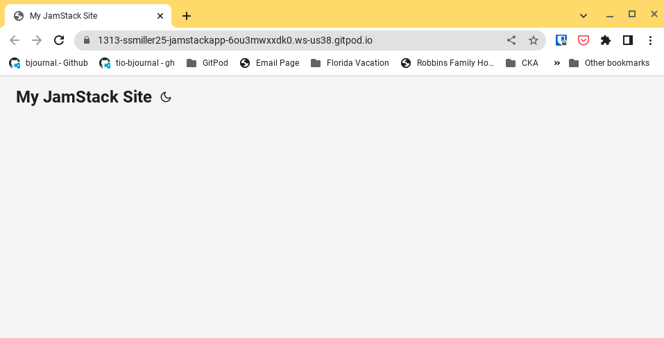

# Getting Started with JAMStack on Civo - The Stack site

## Overview

Now that a [Gitpod development environment in place](https://www.civo.com/learn/civo-development-environment-with-gitpod), let's setup the groundwork for the **M** part in JAMstack - a markdown oriented static site.  This site will host all our user-accessible static content, as well as our dynamic frontend pieces as they are implemented.

## Enviornment Setup 

We will be utilizing [Hugo](https://gohugo.io/) for our static site generation.  A large part of this tutorial will be based on [Alejandro's excellent article on deploying a Hugo site](https://www.civo.com/learn/using-civo-k3s-service-to-host-your-blog-in-hugo-using-github-actions), but leveraging the Gitpod environment for development and deployment.

First, ensure your Gitpod environment is setup and has access to Civo:

```sh
civo k3s list  #Ensure no error is reported back 
```

As we are using Hugo, let's set that up in our Gitpod environment.  Your Gitpod environment has access to Homebrew, so we will use that.  Although there are several ways to install in a Gitpod environment, I prefer to embed software that will be used regularly into a custom Docker image for my environment.  Create a `.gitpod.Dockerfile`, and add the following:

```text
FROM quay.io/ssmiller25/gitpod-k8s:latest

# Install hugo
RUN brew install hugo
```

Edit your `.gitpod.yml` configuration, and change the `image` link to match below.  (the rest of the file was setup in the [first article](https://www.civo.com/learn/civo-development-environment-with-gitpod))

```yaml
image:
  file: .gitpod.Dockerfile
tasks:
  - name: Login to Cloud Resources
    command: |
      bash $HOME/scripts/00-cloudinit.sh
vscode:
  extensions:
    - ms-azuretools.vscode-docker
    - ms-kubernetes-tools.vscode-kubernetes-tools
```

Save and commit all your changes.  Then relaunch Gitpod for your repository.  The first time you open **will take a while (several minutes)!**  Once the new container is build, the launch time should be drastically reduced.  Once up, let's verify we have Hugo installed.  Run this from the terminal in your Gitpod instance

```sh
hugo version
```

If that returns a version number, we are good

## Initial Site Development

Let's use hugo to setup an initial site:

```sh
hugo new site jamstacksite -f yml
```

A new `jamstackapp` directory will be created in your repo, with the standard layout for a hugo site.  We are going to use the [PaperMod theme](https://github.com/adityatelange/hugo-PaperMod) to get started, but most others should work.

```sh
git submodule add --depth=1 https://github.com/adityatelange/hugo-PaperMod.git jamstacksite/themes/papermod
```

Update `jamstacksite/config.yml` to match the following:

```yaml
baseURL: http://example.org/
languageCode: en-us
title: "My JamStack Site"
theme: "papermod"
```

Now let's make sure we have a functional site.  Run the following commands in the gitpod terminal:

```sh
cd jamstacksite/
hugo serve
```

Once hugo begin serving, Gitpod will detect the newly open port and give you a chance to preview the site.



Click the "Open Browser", and a new window should appear with the website as it is now:



## More infomration

- [Using Civo to Host Your Blog in Hugo](https://www.civo.com/learn/using-civo-k3s-service-to-host-your-blog-in-hugo-using-github-actions)
